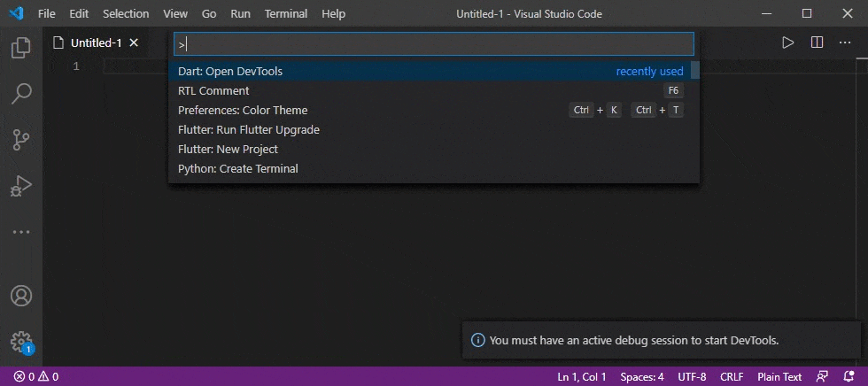

# RTL Comment Support

With this extension you can leave comments for your code in right-to-left languages like persian, arabic and etc.

## How to use
1. open command palette (ctrl + shift + p Or F1) and write "RTL Comment" and press enter. no case sensitive.
2. after input box opened , write or paste your text and press enter.
3. the text has converted to RTL format and copied to the clipboard.
4. paste result in your code, and enjoy.

## Note
you can paste result in any application like visual studio (all version) , notepad and etc.

## Key Binding

 shortcut key is F6

## Requirements

no requir anything.

## Known Issues
At this time, there are no known issues. If you discover a bug or would like to see a shortcut added, please create a pull request at our GitHub page.

## Version 1.0.0

Initial release of RTL Comment Support.

## GitHub
[source code](https://github.com/Rouhollah/rtl-comment-support)
-----------------------------------------------------------------------------------------------------------

**Rouhollah Torshizi!**
